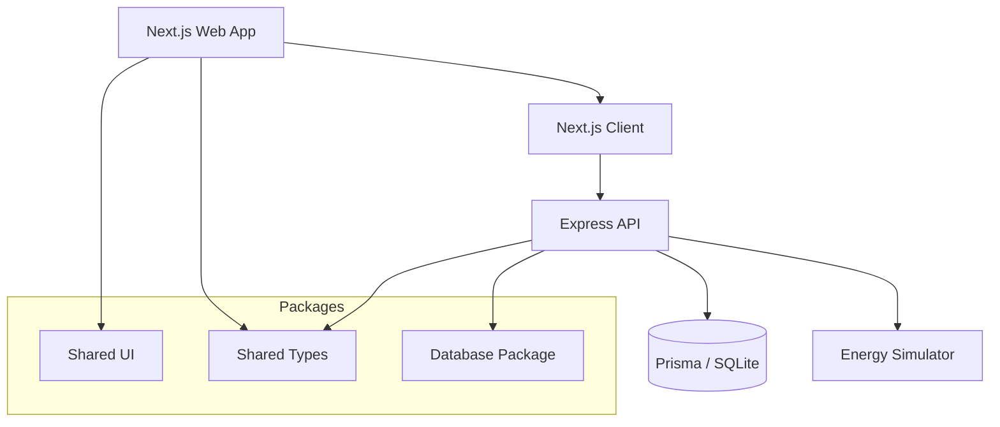

# Energy Flow

A high-performance monorepo for microgrid and energy management, built with Turborepo, Next.js, Express, and Prisma.

## Architecture Overview



## Project Structure

This monorepo includes the following applications and packages:

### Applications

- `apps/web`: A [Next.js](https://nextjs.org/) dashboard for monitoring energy flow, visualization, and alerts.
- `apps/api`: An [Express](https://expressjs.com/) backend that handles microgrid data, energy readings, and power simulation.

### Shared Packages

- `packages/database`: Centralized data layer using [Prisma](https://www.prisma.io/) and SQLite.
- `packages/ui`: Shared React component library.
- `packages/types`: Shared TypeScript definitions across frontend and backend.
- `packages/eslint-config`: Shared ESLint configurations.
- `packages/typescript-config`: Shared `tsconfig.json` files.

## Getting Started

### Prerequisites

- Node.js (v18+)
- npm

### Installation

```sh
npm install
```

### Development

To start all applications and packages in development mode:

```sh
npm run dev
```

This will concurrently run the Next.js frontend and the Express API.

### Database Setup

1. Generate the Prisma Client:
   ```sh
   npm run generate --workspace=packages/database
   ```
2. Run database migrations:
   ```sh
   npm run db:push --workspace=packages/database
   ```
3. (Optional) Seed the database with mock data:
   ```sh
   npm run seed --workspace=packages/database
   ```

## Useful Commands

- `npm run build`: Build all projects.
- `npm run lint`: Run linting across the monorepo.
- `turbo dev --filter=web`: Start only the web application.
- `turbo dev --filter=api`: Start only the api application.

## Documentation

- [API Documentation](apps/api/README.md)
- [Database Guide](packages/database/README.md)
- [Web App Guide](apps/web/README.md)
