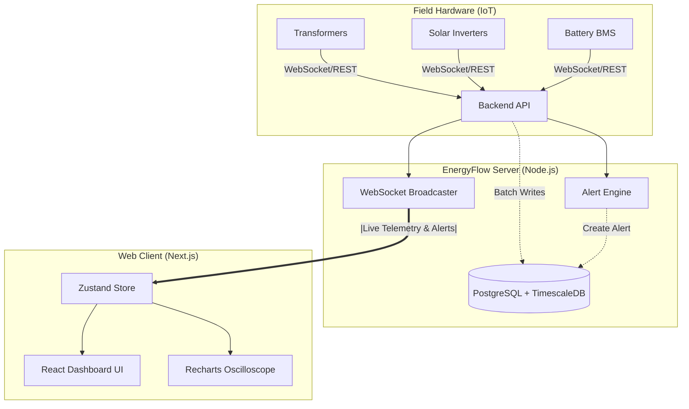

# System Architecture

## 1. Overview
EnergyFlow OS is a modern, distributed systems architecture designed for high-throughput IoT telemetry ingestion and real-time frontend observability. It leverages a Turborepo monorepo structure to share types and configurations between a Node.js backend and a Next.js frontend.

## 2. Technology Stack
*   **Frontend:** Next.js (React), Tailwind CSS, Recharts, Zustand (State Management).
*   **Backend:** Node.js, Express, native WebSockets (`ws`), Zod.
*   **Database:** PostgreSQL with TimescaleDB extension, Prisma ORM.
*   **Workspace:** Turborepo, TypeScript.

## 3. System Components

### 3.1 Device Gateway & Telemetry Service (Backend)
The entry point for all IoT hardware. 
*   Physical devices format their sensor readings into JSON payloads.
*   Devices open a long-lived WebSocket connection to the Express server (`wss://[api-url]?token=[auth-token]`) or push data via REST.
*   The Telemetry Service instantly evaluates incoming packets against the **Alert Engine** to determine if thresholds have been breached.

### 3.2 Real-time Event Bus (WebSocket Broadcaster)
Once the Telemetry Service validates a reading, it acts as a broadcaster.
*   It packages the data (and any generated alerts).
*   It blasts this data over WebSockets to all authenticated, connected frontend dashboard clients in real-time.

### 3.3 Database Layer (PostgreSQL / TimescaleDB)
*   **Relational Data (Prisma):** Organizations, Users, Sites, Devices, and Alert Rules are stored in standard PostgreSQL tables.
*   **Time-Series Data (TimescaleDB):** `EnergyReading` payloads are written to a specialized TimescaleDB Hypertable. This allows for massive write-throughput and extremely fast time-bucketed queries over millions of rows.

### 3.4 Command Center Dashboard (Frontend)
The operator's view into the system.
*   Connects to the backend via WebSocket.
*   Ingests telemetry streams at highly frequent intervals (e.g., 10 packets per second).
*   Uses a **Zustand Store** to buffer and aggregate these packets in memory outside the React render cycle, resolving performance bottlenecks.
*   Renders aggregated data to the user via optimized Recharts components.

## 4. Architecture Diagram (Conceptual)

